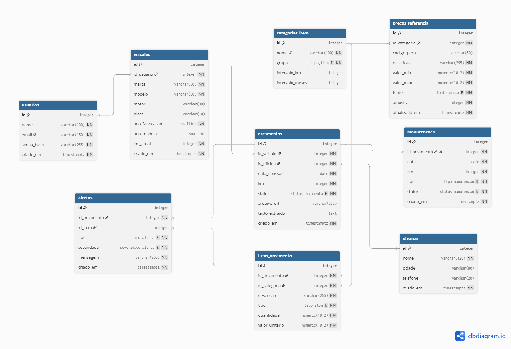

# Revisa

Aplicativo para registrar manutenções de veículos e **analisar orçamentos de oficina**: extrai os itens do orçamento, compara preços com o histórico e sinaliza cobranças suspeitas antes de você aprovar o serviço.

> **Status:** em desenvolvimento. A modelagem do banco de dados está concluída; a API está em construção.

## O problema

Quem não entende de mecânica não tem como saber se um orçamento está caro, se um item é desnecessário ou se aquela peça já foi trocada há pouco tempo. O Revisa usa o histórico do próprio veículo e uma base de preços de referência para responder a essas perguntas.

## Funcionalidades planejadas

- Cadastro de veículos e histórico de manutenções
- Registro de orçamentos, com itens separados em peça e mão de obra
- Extração automática dos itens a partir de foto ou PDF do orçamento
- Comparação de dois ou mais orçamentos lado a lado
- Orçamento aprovado vira registro de manutenção
- Alertas automáticos na análise do orçamento:

| Alerta | Quando dispara |
|---|---|
| `TROCA_RECENTE` | A mesma categoria foi trocada há poucos km ou meses |
| `PRECO_ACIMA_MEDIA` | Valor acima da faixa de referência ou de um orçamento concorrente |
| `MAO_OBRA_ALTA` | Mão de obra desproporcional ao total |
| `ITEM_DUPLICADO` | Mesmo item lançado mais de uma vez |
| `ITEM_GENERICO` | Descrição vaga, sem discriminação do que será feito |
| `CONSUMIVEL_CARO` | Consumíveis (estopa, graxa, etc.) acima do esperado |
| `VALOR_ZERADO` | Item sem valor, que pode virar cobrança depois |

## Modelo de dados



| Tabela | Função |
|---|---|
| `usuarios` | Donos dos veículos |
| `veiculos` | Veículos de cada usuário |
| `oficinas` | Oficinas que emitem os orçamentos |
| `orcamentos` | Orçamento de uma oficina para um veículo |
| `itens_orcamento` | Cada linha do orçamento (peça ou mão de obra) |
| `categorias_item` | Catálogo que padroniza os itens e guarda os intervalos de troca |
| `precos_referencia` | Faixa de preço (mínimo e máximo) esperada por categoria |
| `alertas` | Avisos gerados na análise de um orçamento |
| `manutencoes` | Serviço realizado a partir de um orçamento aprovado |

### Decisões de modelagem

- **Itens categorizados:** oficinas escrevem o mesmo item de formas diferentes. A tabela `categorias_item` padroniza os itens e permite comparar preços e detectar trocas recentes.
- **Total não armazenado:** o valor do orçamento é calculado pela soma dos itens, o que evita divergência entre o total e os itens.
- **Uma manutenção por orçamento:** a chave estrangeira `manutencoes.id_orcamento` é única.
- **Quilometragem no orçamento e na manutenção:** registra o km no momento do serviço, base dos alertas de troca recente.
- **Preço de referência em faixa:** `precos_referencia` guarda mínimo e máximo, com a origem do dado (manual, histórico ou externo).
- **Regras no banco:** restrições `CHECK` impedem quilometragem negativa, quantidade zerada e faixa de preço invertida.

## Tecnologias

| Camada | Tecnologia |
|---|---|
| Banco de dados | PostgreSQL |
| Back-end | Python, FastAPI, SQLAlchemy, Alembic |
| Testes | pytest |
| Infraestrutura | Docker, GitHub Actions |

## Como rodar o banco

Pré-requisito: PostgreSQL 14 ou superior.

```bash
createdb revisa
psql -d revisa -f database/schema.sql
psql -d revisa -f database/seed.sql
psql -d revisa -f database/queries.sql
```

Os arquivos devem ser executados nessa ordem. Também é possível abri-los em um cliente como o DBeaver.

O `queries.sql` traz as consultas usadas para validar o modelo, cada uma com o resultado esperado em comentário.

## Estrutura do repositório

```
database/
 ├── schema.sql      estrutura: tipos, tabelas, índices e restrições
 ├── seed.sql        dados iniciais e de teste (fictícios)
 ├── queries.sql     consultas de validação com o resultado esperado
 ├── modelo.dbml     código-fonte do diagrama (dbdiagram.io)
 └── diagrama.png    diagrama do banco
```

## Roadmap

- [x] Modelagem do banco de dados
- [ ] API: autenticação e cadastro de veículos
- [ ] Orçamentos, itens e histórico de manutenções
- [ ] Upload do orçamento e extração automática dos itens
- [ ] Motor de alertas
- [ ] Comparador de orçamentos e aprovação
- [ ] Testes automatizados, CI e deploy

## Autor

Wellington Strehle — projeto pessoal de estudo e portfólio.
